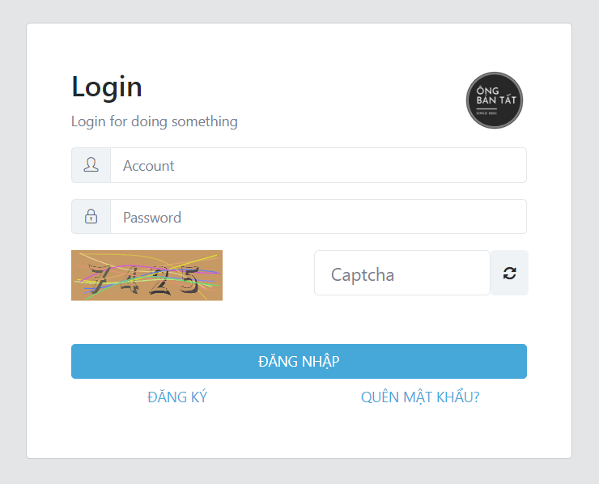

# Overview

1. Login

<figure><figcaption>
Login Screen
</figcaption></figure>

2. Home Page

<figure><figcaption>
Home Page Screen
</figcaption></figure>

3. Profile

<figure><figcaption>
Profile Screen
</figcaption></figure>

4. Menu&#x20;

<figure><figcaption>
Menu Screen
</figcaption></figure>

5. Page

<figure><figcaption>
Page Screen
</figcaption></figure>

6. Permission

<figure><figcaption>
Permission Screen
</figcaption></figure>

7. User

<figure><figcaption>
User Screen
</figcaption></figure>

