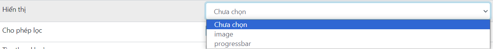

# Create Page Grid

1.  Click on Grid

    <figure><figcaption></figcaption></figure>
2. Grid Detail

<figure><figcaption></figcaption></figure>

*   <mark style="color:blue;">**Highlight:**</mark>&#x20;

    <figure><figcaption>
<mark style="color:yellow;"><strong>After enabled "Highlight"</strong></mark>
</figcaption></figure>
* <mark style="color:blue;">**Tên (**</mark><mark style="color:orange;">**"Name"**</mark><mark style="color:blue;">**):**</mark> A field to input the name of the grid.
* <mark style="color:blue;">**Trường dữ liệu (**</mark><mark style="color:orange;">**"Data field"**</mark><mark style="color:blue;">**):**</mark> A field to specify the data field associated with the grid. That data name will match with the variable name of value which return. Example if you return\
  `{` \
  `"id": "12345",` \
  `"name": "John Doe",` \
  `"email": "john.doe@example.com",` \
  `"password": "securePassword123"` \
  `}` <mark style="color:orange;">**"id"**</mark> will match with the your input name <mark style="color:orange;">**("id")**</mark>
* <mark style="color:blue;">**Điều kiện ẩn (**</mark><mark style="color:orange;">**"Hidden condition"**</mark><mark style="color:blue;">**):**</mark> A field to define conditions under which the grid or specific data fields are hidden.
*   <mark style="color:blue;">**Phân Quyền (**</mark><mark style="color:orange;">**"Permission"**</mark><mark style="color:blue;">**):**</mark> A section to set permissions for the grid, with an option to add more permissions.

    <figure><figcaption></figcaption></figure>
*   <mark style="color:blue;">**Kiểu dữ liệu (**</mark><mark style="color:orange;">**"Data type"**</mark><mark style="color:blue;">**):**</mark> A dropdown menu to select the type of data displayed in the grid (e.g., text, number, date). If you select number type then below will show the Format number button. Ex: <mark style="color:green;">1000</mark> (non-format) -> <mark style="color:green;">1,000</mark> (format on).

    <figure><figcaption></figcaption></figure>
*   <mark style="color:blue;">**Danh sách có sẵn (**</mark><mark style="color:orange;">**"Items"**</mark><mark style="color:blue;">**):**</mark> This field gives you a list as an enum list and you fill in the corresponding values ​​according to Key-Value. Example: When u show in grid the gender value of user. In your database the value is <mark style="color:orange;">**0, 1 or empty**</mark>. But you want to show <mark style="color:orange;">**Male, Female or others**</mark> instead of that.

    <figure><figcaption>
<mark style="color:yellow;"><strong>"Danh sách có sẵn" enabled</strong></mark>
</figcaption></figure>

    <figure><figcaption>
<mark style="color:yellow;"><strong>Non using "Danh sách có sẵn"</strong></mark> 
</figcaption></figure>

    <figure><figcaption>
<mark style="color:yellow;"><strong>Using "Danh sách có sẵn"</strong></mark> 
</figcaption></figure>
*   <mark style="color:blue;">**Danh sách chọn csdl (**</mark><mark style="color:orange;">**"Database chosen list"**</mark><mark style="color:blue;">**):**</mark>

    <figure><figcaption></figcaption></figure>
*   <mark style="color:blue;">**HIển thị (**</mark><mark style="color:orange;">**"Display"**</mark><mark style="color:blue;">**):**</mark> A field to define how the data should be displayed in the grid (e.g., image, progressbar).

    <figure><figcaption></figcaption></figure>
*   <mark style="color:blue;">**Cho phép lọc (**</mark><mark style="color:orange;">**"Enable filtering"**</mark><mark style="color:blue;">**):**</mark> A checkbox to enable filtering options for the grid data. You can defind the type of filter.

    <figure><figcaption>
<mark style="color:yellow;"><strong>Disable Filter</strong></mark>
</figcaption></figure>

    <figure><figcaption>
<mark style="color:yellow;"><strong>Enable Filter</strong></mark>
</figcaption></figure>
* <mark style="color:blue;">**Nút bấm thay thế (**</mark><mark style="color:orange;">**"Replacement button"**</mark><mark style="color:blue;">**):**</mark> This data field is related to some more difficult operations, see more in  [<mark style="color:yellow;">Button Operations</mark>](others.md).
